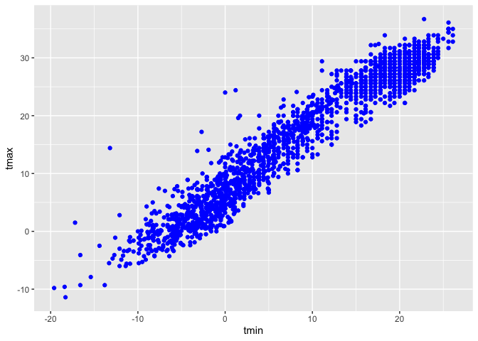

Viz 1
================
2024-09-26

Import the weather data

``` r
weather_df <- 
  rnoaa::meteo_pull_monitors(
    c("USW00094728", "USW00022534", "USS0023B17S"),
    var = c("PRCP", "TMIN", "TMAX"), 
    date_min = "2021-01-01",
    date_max = "2022-12-31") |>
  mutate(
    name = case_match(
      id, 
      "USW00094728" ~ "CentralPark_NY", 
      "USW00022534" ~ "Molokai_HI",
      "USS0023B17S" ~ "Waterhole_WA"),
    tmin = tmin / 10,
    tmax = tmax / 10) |>
  select(name, id, everything())
```

## Basic scatter plot

``` r
weather_df |>
  ggplot(aes(x = tmin, y = tmax)) + 
  geom_point()
```

    ## Warning: Removed 17 rows containing missing values or values outside the scale range
    ## (`geom_point()`).

<!-- -->

saving it to a variable

``` r
ggp_weather_scatterplot <- 
  weather_df |> 
  ggplot(aes(x = tmin, y = tmax)) + 
  geom_point()
```

Can see that ggplot warns about missing rows:

``` r
weather_df |>
  filter(is.na(tmax))
```

    ## # A tibble: 17 × 6
    ##    name         id          date        prcp  tmax  tmin
    ##    <chr>        <chr>       <date>     <dbl> <dbl> <dbl>
    ##  1 Molokai_HI   USW00022534 2022-05-31    NA    NA    NA
    ##  2 Waterhole_WA USS0023B17S 2021-03-09    NA    NA    NA
    ##  3 Waterhole_WA USS0023B17S 2021-12-07    51    NA    NA
    ##  4 Waterhole_WA USS0023B17S 2021-12-31     0    NA    NA
    ##  5 Waterhole_WA USS0023B17S 2022-02-03     0    NA    NA
    ##  6 Waterhole_WA USS0023B17S 2022-08-09    NA    NA    NA
    ##  7 Waterhole_WA USS0023B17S 2022-08-10    NA    NA    NA
    ##  8 Waterhole_WA USS0023B17S 2022-08-11    NA    NA    NA
    ##  9 Waterhole_WA USS0023B17S 2022-08-12    NA    NA    NA
    ## 10 Waterhole_WA USS0023B17S 2022-08-13    NA    NA    NA
    ## 11 Waterhole_WA USS0023B17S 2022-08-14    NA    NA    NA
    ## 12 Waterhole_WA USS0023B17S 2022-08-15    NA    NA    NA
    ## 13 Waterhole_WA USS0023B17S 2022-08-16    NA    NA    NA
    ## 14 Waterhole_WA USS0023B17S 2022-08-17    NA    NA    NA
    ## 15 Waterhole_WA USS0023B17S 2022-08-18    NA    NA    NA
    ## 16 Waterhole_WA USS0023B17S 2022-08-19    NA    NA    NA
    ## 17 Waterhole_WA USS0023B17S 2022-12-31    76    NA    NA

## Fancier scatter plot

``` r
weather_df |> 
  ggplot(aes(x = tmin, y = tmax, color = name)) + 
  geom_point(alpha = 0.3, size = 0.8) +
  geom_smooth(se = FALSE)
```

    ## `geom_smooth()` using method = 'loess' and formula = 'y ~ x'

    ## Warning: Removed 17 rows containing non-finite outside the scale range
    ## (`stat_smooth()`).

    ## Warning: Removed 17 rows containing missing values or values outside the scale range
    ## (`geom_point()`).

<!-- -->

Where you define aesthetics matters

This only applies color = name to the points, not to geom_smooth.
geom_smooth does not ‘know’ about color = name.

``` r
weather_df |> 
  ggplot(aes(x = tmin, y = tmax)) + 
  geom_point(aes(color = name),alpha = 0.3, size = 0.8) +
  geom_smooth(se = FALSE)
```

    ## `geom_smooth()` using method = 'gam' and formula = 'y ~ s(x, bs = "cs")'

    ## Warning: Removed 17 rows containing non-finite outside the scale range
    ## (`stat_smooth()`).

    ## Warning: Removed 17 rows containing missing values or values outside the scale range
    ## (`geom_point()`).

<!-- -->

use faceting

``` r
weather_df |>
  ggplot(aes(x = tmin, y = tmax, color = name)) + 
  geom_point(alpha = 0.3) + 
  geom_smooth(se = FALSE) +
  facet_grid(. ~ name) #LHS is rows (.=nothing), RHS is columns
```

    ## `geom_smooth()` using method = 'loess' and formula = 'y ~ x'

    ## Warning: Removed 17 rows containing non-finite outside the scale range
    ## (`stat_smooth()`).

    ## Warning: Removed 17 rows containing missing values or values outside the scale range
    ## (`geom_point()`).

<!-- -->

Make a more interesting scatterplot

``` r
weather_df |>
  ggplot(aes(x = date, y = tmax, color = name, size = prcp)) +
  geom_point() +
  geom_smooth(se = FALSE) +
  facet_grid(.~name)
```

    ## Warning: Using `size` aesthetic for lines was deprecated in ggplot2 3.4.0.
    ## ℹ Please use `linewidth` instead.
    ## This warning is displayed once every 8 hours.
    ## Call `lifecycle::last_lifecycle_warnings()` to see where this warning was
    ## generated.

    ## `geom_smooth()` using method = 'loess' and formula = 'y ~ x'

    ## Warning: Removed 17 rows containing non-finite outside the scale range
    ## (`stat_smooth()`).

    ## Warning: The following aesthetics were dropped during statistical transformation: size.
    ## ℹ This can happen when ggplot fails to infer the correct grouping structure in
    ##   the data.
    ## ℹ Did you forget to specify a `group` aesthetic or to convert a numerical
    ##   variable into a factor?
    ## The following aesthetics were dropped during statistical transformation: size.
    ## ℹ This can happen when ggplot fails to infer the correct grouping structure in
    ##   the data.
    ## ℹ Did you forget to specify a `group` aesthetic or to convert a numerical
    ##   variable into a factor?
    ## The following aesthetics were dropped during statistical transformation: size.
    ## ℹ This can happen when ggplot fails to infer the correct grouping structure in
    ##   the data.
    ## ℹ Did you forget to specify a `group` aesthetic or to convert a numerical
    ##   variable into a factor?

    ## Warning: Removed 19 rows containing missing values or values outside the scale range
    ## (`geom_point()`).

<!-- -->

Write a code chain that starts with weather_df; focuses only on Central
Park, converts temperatures to Fahrenheit, makes a scatterplot of min
vs. max temperature, and overlays a linear regression line (using
options in geom_smooth()).

``` r
weather_df |>
  filter(name == "CentralPark_NY") |>
  mutate(tmax_f = 9/5 * tmax + 32,
         tmin_f = 9/5 * tmin + 32) |>
  ggplot(aes(x = tmin_f, y = tmax_f)) + 
  geom_point() +
  geom_smooth(method = "lm")
```

    ## `geom_smooth()` using formula = 'y ~ x'

<!-- -->

## Small things

``` r
weather_df |> 
  ggplot(aes(x = tmin, y = tmax)) + 
  geom_hex()
```

    ## Warning: Removed 17 rows containing non-finite outside the scale range
    ## (`stat_binhex()`).

<!-- -->

there is no variable “blue”, so putting color = “blue” in ggplot(aes())
does not work out

``` r
weather_df |>
  ggplot(aes(x = tmin, y = tmax,color = "blue")) + 
  geom_point()
```

    ## Warning: Removed 17 rows containing missing values or values outside the scale range
    ## (`geom_point()`).

<!-- -->

This will work:

``` r
weather_df |>
  ggplot(aes(x = tmin, y = tmax)) + 
  geom_point(color = "blue")
```

    ## Warning: Removed 17 rows containing missing values or values outside the scale range
    ## (`geom_point()`).

<!-- -->

## Univariate plots

``` r
weather_df |>
  ggplot(aes(x = tmin, fill = name)) +
  geom_histogram(position = "dodge")
```

    ## `stat_bin()` using `bins = 30`. Pick better value with `binwidth`.

    ## Warning: Removed 17 rows containing non-finite outside the scale range
    ## (`stat_bin()`).

<!-- -->

How to fix this/make it better? Maybe facet?

Also not great, but better

``` r
weather_df |>
  ggplot(aes(x = tmin, fill = name)) + 
  geom_histogram() +
  facet_grid(.~name)
```

    ## `stat_bin()` using `bins = 30`. Pick better value with `binwidth`.

    ## Warning: Removed 17 rows containing non-finite outside the scale range
    ## (`stat_bin()`).

<!-- -->

Maybe a density plot?

``` r
weather_df |>
  ggplot(aes(x = tmin, fill = name)) + 
  geom_density(alpha = 0.3)
```

    ## Warning: Removed 17 rows containing non-finite outside the scale range
    ## (`stat_density()`).

<!-- -->

boxplots

``` r
weather_df |>
  ggplot(aes(x = name, y = tmin)) + 
  geom_boxplot()
```

    ## Warning: Removed 17 rows containing non-finite outside the scale range
    ## (`stat_boxplot()`).

<!-- -->

try violin plots

``` r
weather_df |>
  ggplot(aes(x = name, y = tmin, fill = name)) + 
  geom_violin()
```

    ## Warning: Removed 17 rows containing non-finite outside the scale range
    ## (`stat_ydensity()`).

<!-- -->

Another option: ridge plot

``` r
weather_df |>
  ggplot(aes(x = tmin, y = name)) + 
  geom_density_ridges()
```

    ## Picking joint bandwidth of 1.41

    ## Warning: Removed 17 rows containing non-finite outside the scale range
    ## (`stat_density_ridges()`).

<!-- -->

Make plots that compare precipitation across locations. Try a histogram,
a density plot, a boxplot, a violin plot, and a ridgeplot; use aesthetic
mappings to make your figure readable.

``` r
weather_df |>
  ggplot(aes(x = prcp, fill = name)) + 
  geom_density(alpha = 0.3)
```

    ## Warning: Removed 15 rows containing non-finite outside the scale range
    ## (`stat_density()`).

<!-- -->

``` r
weather_df |>
  ggplot(aes(x = name, y = prcp, fill = name)) + 
  geom_violin()
```

    ## Warning: Removed 15 rows containing non-finite outside the scale range
    ## (`stat_ydensity()`).

<!-- -->

``` r
weather_df |>
  ggplot(aes(x = prcp, y = name)) + 
  geom_density_ridges()
```

    ## Picking joint bandwidth of 9.22

    ## Warning: Removed 15 rows containing non-finite outside the scale range
    ## (`stat_density_ridges()`).

<!-- -->

None of these options look to good, maybe if we removed 0 precip days?

``` r
weather_df |>
  filter(prcp > 0) |>
  ggplot(aes(x = prcp, y = name)) + 
  geom_density_ridges()
```

    ## Picking joint bandwidth of 20.6

<!-- -->

## saving and embedding plots

``` r
ggp_weather <- weather_df |>
  ggplot(aes(x = date, y= tmax, color = name)) +
  geom_point()

ggsave("plots/ggp_weather.pdf",ggp_weather, width = 8, height = 6)
```

    ## Warning: Removed 17 rows containing missing values or values outside the scale range
    ## (`geom_point()`).

Embedding plots

``` r
weather_df |>
  ggplot(aes(x = date, y= tmax, color = name)) +
  geom_point()
```

    ## Warning: Removed 17 rows containing missing values or values outside the scale range
    ## (`geom_point()`).

<!-- -->
